# The Attractor Atlas

*Four novel strange attractors — **Aurelia** (C₃), **Naiad** (C₂), **Cassiopea** (C₄), and **Mobula** (S₄ rotoreflection) — discovered, certified, and named in June 2026, together with the quality-diversity engine that finds them. They are the first entries in a [periodic table of strange attractors ordered by symmetry](docs/SYMMETRY_PROGRAM.md); Aurelia, the moon jellyfish of the family, leads the tour.*

**[Explore all four live in your browser](https://sakeeb91.github.io/attractor-atlas/)**: a WebGL viewer with 400,000 orbit points, 3,000 particles riding the flow in real time, orbit controls, live parameter sliders, and a switcher between attractors.

**[Read the story](STORY.md)**: a long-form narrative of the whole arc, from the failed first family through the 600-universe search and the certification of Aurelia, to the quality-diversity engine that found its siblings Naiad and Cassiopea, and on to Mobula — the first member whose symmetry is a rotation-plus-reflection.


## The system

The Aurelia attractor lives in a three-dimensional autonomous flow with two quadratic
nonlinearities in the plane and a cubic one on the axis:

```
dx/dt = a(z − b)x − cy + b(x² − y²)
dy/dt = cx + a(z − b)y − 2bxy
dz/dt = a(1 + z) − z³ − c(x² + y²)
```

with the canonical parameters

```
a = 1.4,   b = 0.5,   c = 1.9
```

and any generic initial condition near the origin, e.g. `(0.3, 0.2, 0.1)`.

Writing the planar coordinates as a single complex number **w = x + iy**, the system
collapses to two elegant equations:

```
dw/dt = [a(z − b) + ic] w + b w̄²
dz/dt = a(1 + z) − z³ − c|w|²
```

The conjugate-squared term `w̄²` is the heart of the design: under a rotation of the
plane by 120°, `w → e^(2πi/3) w` maps solutions to solutions, so the flow is
**equivariant under the cyclic group C₃**. The strange attractor inherits this
three-fold symmetry — visible as the triskelion in the crown view below. The `z`
equation couples back through the radius `|w|²` alone, preserving the symmetry while
pumping trajectories vertically.

## Why "Aurelia"

*Aurelia aurita* is the moon jellyfish. Seen from the side, the attractor is a
translucent bell with veils trailing beneath it and a luminous column rising through
its center — the unstable axis along which trajectories are reinjected. From the
Latin *aureus*, "golden": orbits spend their slow hours in the gilded crown at the
top of the bell before being flung back into the dark. The name was unclaimed in the
dynamical-systems literature at the time of discovery.

## Gallery

| The crown (top view) | The bell (side view) |
|---|---|
|  |  |

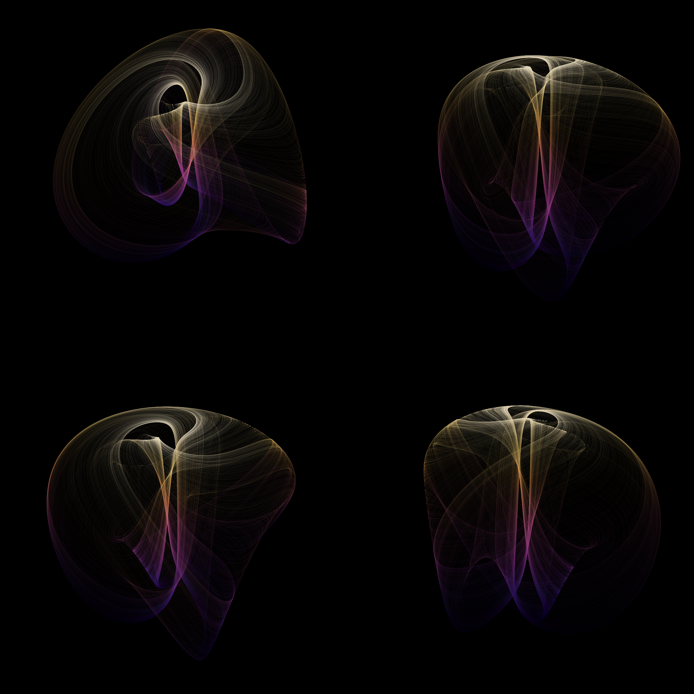

One full orbit of the camera (`python scripts/render_animation.py`):


## Certification of chaos

All numbers below are reproducible with `python scripts/verify_chaos.py`
(recorded in [`results/verification.json`](results/verification.json)).

| Property | Value |
|---|---|
| Lyapunov spectrum (Benettin/QR, 600k steps) | **λ₁ = +0.2327**, λ₂ = +0.0013 ≈ 0, λ₃ = −1.5119 |
| Kaplan–Yorke dimension | **D_KY ≈ 2.155** (fractal) |
| λ₁ across 5 random initial conditions | 0.195 … 0.252 (always positive) |
| Convergence study (3 dt × 3 lengths × 10 ICs) | λ₁ = +0.230 ± 0.009, D_KY = 2.151 ± 0.006 ([gallery/convergence.png](gallery/convergence.png), [results/convergence.json](results/convergence.json)) |
| Equilibria | exactly one: saddle-focus at (0, 0, 1.5229) |
| Eigenvalues at the equilibrium | 1.432 ± 1.9i (unstable spiral), −5.558 (strong contraction) |
| Boundedness | confirmed over 4,000,000 RK4 steps |
| Time-averaged divergence | −1.290 (dissipative: volumes contract onto the attractor) |
| Attractor extent | x ∈ [−1.40, 1.60], y ∈ [−1.67, 1.27], z ∈ [−0.98, 1.50] |

The signature `(+, 0, −)` spectrum with a fractal dimension strictly between 2 and 3
certifies a **strange attractor**, not a limit cycle or a transient.

### One equilibrium to rule them all

The flow has a *single* fixed point — a saddle-focus on the symmetry axis with
Shilnikov-type geometry. Trajectories spiral outward around the axis (eigenvalues
1.432 ± 1.9i), spill over the rim of the bell, fall along the outer veils, and are
recaptured by the strongly contracting direction (−5.558) at the base of the central
column. Stretch, fold, repeat — forever, never twice the same way.

### Route to chaos and limit cycles

Sweeping the rotation rate `c` with `a, b` fixed
(`python scripts/bifurcation_scan.py`) shows the chaotic sea and its periodic
windows: where the largest Lyapunov exponent falls to ≈ 0, the attractor collapses
to a stable limit cycle; where it is positive, chaos reigns. The canonical
`c = 1.9` sits inside a robust chaotic band.

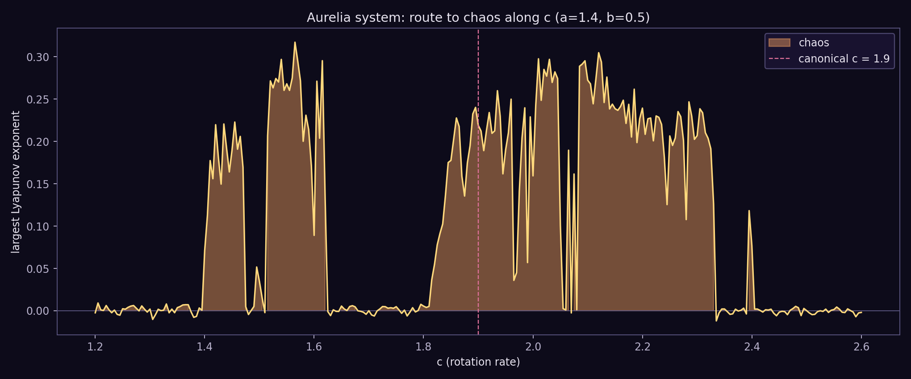

### The homoclinic hunt

Shilnikov's theorem needs two things: the eigenvalue inequality (satisfied by
all three systems, saddle index ν = 0.19–0.26 < 1) and a homoclinic orbit —
the unstable manifold returning exactly to the equilibrium. A shooting hunt
(`python scripts/homoclinic_hunt.py`) launches the manifold from the unstable
eigenplane and sweeps the rotation rate. **Naiad**'s manifold returns to
within **7.5×10⁻⁵** of its saddle-focus at w_rot = 1.833, with a ladder of
seven near-connection windows accumulating below the canonical parameter
(where the distance is still 7.6×10⁻⁴). **Cassiopea**'s returns to within
6.5×10⁻⁴. For those two, homoclinic (Shilnikov) bifurcations almost certainly
thread the family. **Aurelia** is the holdout: along the entire c-band its
manifold keeps a standoff distance of ≈0.13 — the reinjection column re-enters
the spiral plane at finite radius, and any connection must lie off the c-axis.

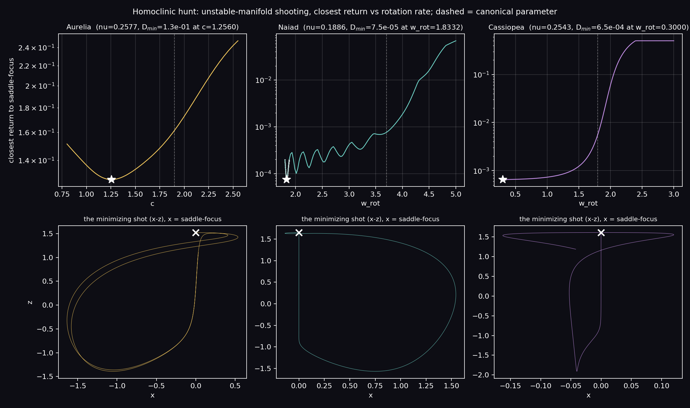

## Novelty

Searched June 10, 2026, before publication:

* **The functional form** — a 3-D autonomous flow built from the C₃-equivariant
  complex coupling `w̄²` (i.e. the pair `x² − y²`, `−2xy`) joined to cubic `z`
  dynamics through `|w|²` — does not appear in the known attractor catalogues
  (Lorenz, Rössler, Thomas, Aizawa/Langford, Halvorsen, Dadras, Chen, Sprott A–S,
  Rabinovich–Fabrikant, multi-scroll/multi-wing families) or in web/literature
  searches for the equation terms. (Full positioning pass against the
  equivariant-covers, multi-scroll, and normal-form literature:
  [docs/RELATED_WORK.md](docs/RELATED_WORK.md).)
* **Closest relatives, and how this differs:** Field & Golubitsky's celebrated
  *symmetric chaos icons* use equivariant polynomial couplings of the same spirit —
  but they are 2-D discrete **maps**, not continuous 3-D flows. The Aizawa/Langford
  attractor is a 3-D flow with rotational coupling — but it is SO(2)-symmetric
  (continuous rotation), has no equivariant `w̄²` term, and has a qualitatively
  different two-equilibrium structure. Discrete Cₙ rotation symmetry *does* occur
  in published 3-D flows — the proto-Lorenz n-fold covers of Miranda & Stone, the
  cover-system theory of Gilmore & Letellier, Thomas's cyclically symmetric system,
  and the engineered multi-scroll families — but in all of these the symmetry is
  either imposed by lifting known dynamics through an angle-multiplying map
  (leaving the vector field singular on the axis and the dynamics locally identical
  to the image system) or acts without Aurelia's plane-plus-axis anatomy. The
  Aurelia system occupies a sparsely populated intersection: *globally polynomial
  flow* × *discrete C₃ equivariance by construction, not by covering* × *single
  organizing saddle-focus*. Full survey:
  [docs/RELATED_WORK.md](docs/RELATED_WORK.md).
* **The name** "Aurelia attractor" had no prior usage.
* **Measured novelty.** Beyond the literature search, novelty is now a number:
  reducing attractors to shape fingerprints (D2 distance histograms + PCA shape
  ratios, see `atlas/fingerprint.py`) and comparing against all 135 known
  chaotic systems in the [dysts](https://github.com/williamgilpin/dysts)
  catalog, Aurelia's nearest known neighbor is the Aizawa attractor at
  distance 0.185. The catalog's own median nearest-neighbor spacing is 0.115;
  83% of known systems sit closer to something known than Aurelia does. By
  this metric, Aurelia is more isolated in shape space than five-sixths of
  the established bestiary, and its nearest relative is exactly the system
  the qualitative analysis predicted. The metric itself is validated in
  `scripts/validate_fingerprint.py`: documented Lorenz-family variants
  cluster (positive control), the algebraically defined Sprott family does
  not (negative control — the fingerprint reads geometry, not algebra), and
  the within-system noise floor is ≈0.05, putting all three of our systems
  3–5 noise floors from anything known. Under re-simulation Aurelia's
  distance is stable at 0.184, with the InteriorSquirmer system
  statistically tied with Aizawa — at this isolation, ties between distant
  neighbors are expected.
  Map: [gallery/fingerprint_map.png](gallery/fingerprint_map.png) ·
  details: [results/fingerprint_validation.json](results/fingerprint_validation.json).

## Discovery method

The attractor was found by Monte-Carlo search over a seven-parameter
C₃-equivariant family (`python scripts/search_parameters.py`), filtering for
bounded orbits with a strongly positive largest Lyapunov exponent, then judged by
eye for beauty — a workflow whose ancestor is Sprott's automated aesthetic hunt
over 2-D maps in 1993. The winning region of parameter space collapsed — remarkably — to
just **three distinct constants** (a, b, c) = (1.4, 0.5, 1.9) with the largest
Lyapunov exponent essentially unchanged.

## The atlas engine: searching for the next Aurelia

`atlas/` is a quality-diversity search engine that hunts for *new* chaotic
attractors in the C&#8345;-equivariant generalization of Aurelia's design
(rotation orders n = 2 to 5, so two-, four-, and five-fold flowers are in
reach). Instead of optimizing a single score, it runs MAP-Elites: descriptor
space (rotation order × Lyapunov exponent × vertical aspect) is tiled into
cells, and each cell keeps the candidate most *novel* relative to a reference
set of known attractors.

Novelty is a measured number, not a literature claim: every candidate's orbit
is reduced to a shape fingerprint (D2 pairwise-distance histogram + PCA shape
ratios + fill factor), and its novelty is the minimum fingerprint distance to
the [dysts](https://github.com/williamgilpin/dysts) catalog of known chaotic
systems plus everything already discovered in the archive.

Evolved chaotic flows exist in the literature — genetic programming over
Lorenz-like vector fields (Pan & Das 2015), and most recently the 20,000-system
Panda corpus bred from the dysts catalog as training data (Lai, Bao & Gilpin
2025) — but, to our knowledge, this is the first *quality-diversity* search over
a family of dynamical systems, with novelty measured against a catalog of known
attractors rather than chaos strength optimized
([docs/RELATED_WORK.md](docs/RELATED_WORK.md)).

The whole shape space at a glance — the dysts catalog as dots, the three
discoveries as stars on the rim of the known cloud (metric MDS of
fingerprint distances, Kruskal stress-1 = 0.13):

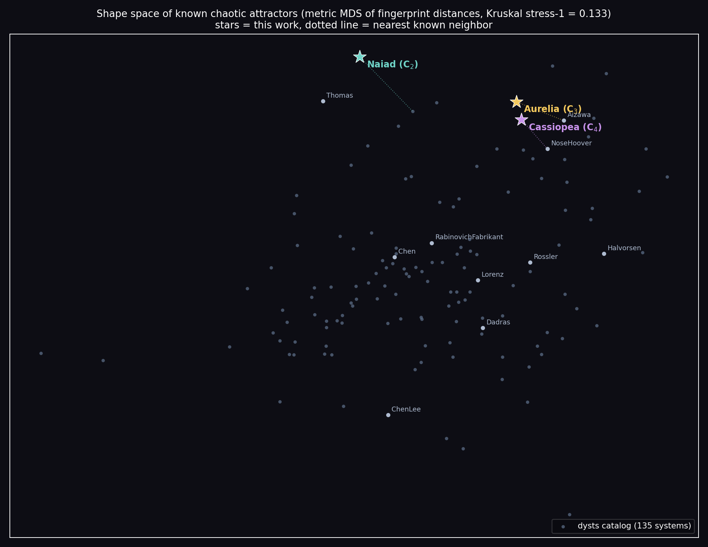

```bash
pip install dysts                                # reference catalog (one-time)
python scripts/build_catalog_fingerprints.py     # fingerprint known systems (one-time)
python scripts/run_atlas.py 12 96                # search: 12 generations, batches of 96
python scripts/render_atlas_montage.py           # render the most novel elites
```

The batched evaluator integrates an entire population simultaneously with
vectorized complex RK4 and reproduces Aurelia's Lyapunov exponent as a
sanity check. The archive persists across runs (`results/atlas/archive.json`),
so the search compounds.

## Naiad: the first attractor the atlas found

The first thing the search turned up worth keeping is **Naiad**, the two-fold
(C₂) sibling of Aurelia, named for the water nymph of fountains and springs.
Where Aurelia rotates three-fold, Naiad uses rotation order n = 2, so the
conjugate term is simply `conj(w)`: an anisotropic stretch that makes the
flow symmetric under a half-turn `(x, y) → (−x, −y)`. The attractor is a
flaring **fountain**: a wide turbulent bowl, a bright jet up the central
axis, a narrow stem at the base. Seen from above it is a lens, not a disk,
because two-fold symmetry stretches it along one direction.

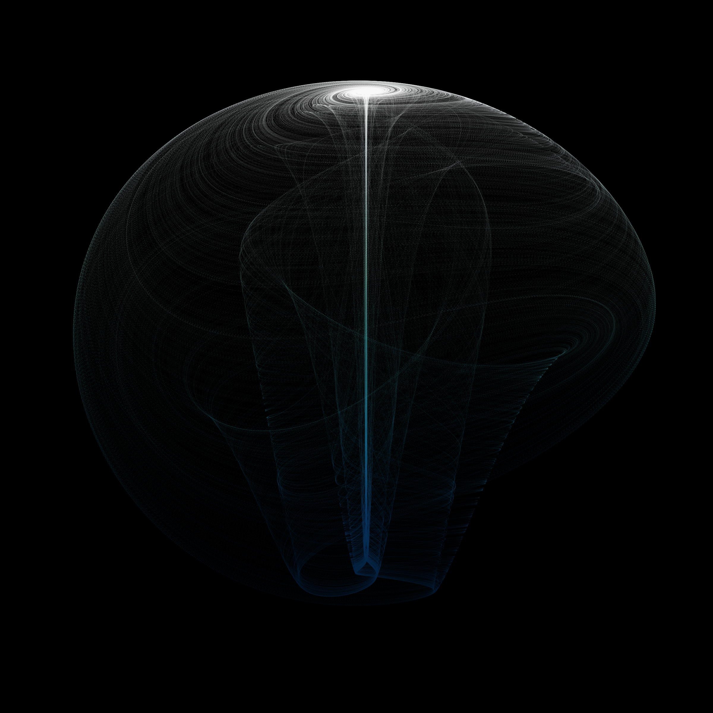

| The lens (top) | The jet (side) |
|---|---|
| 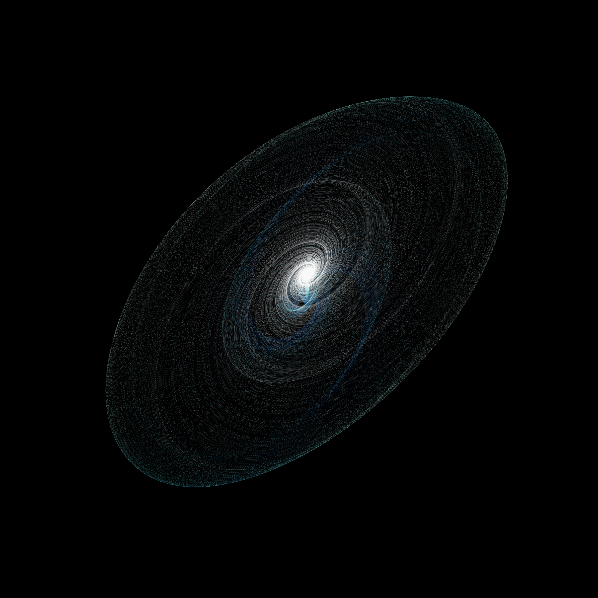 | 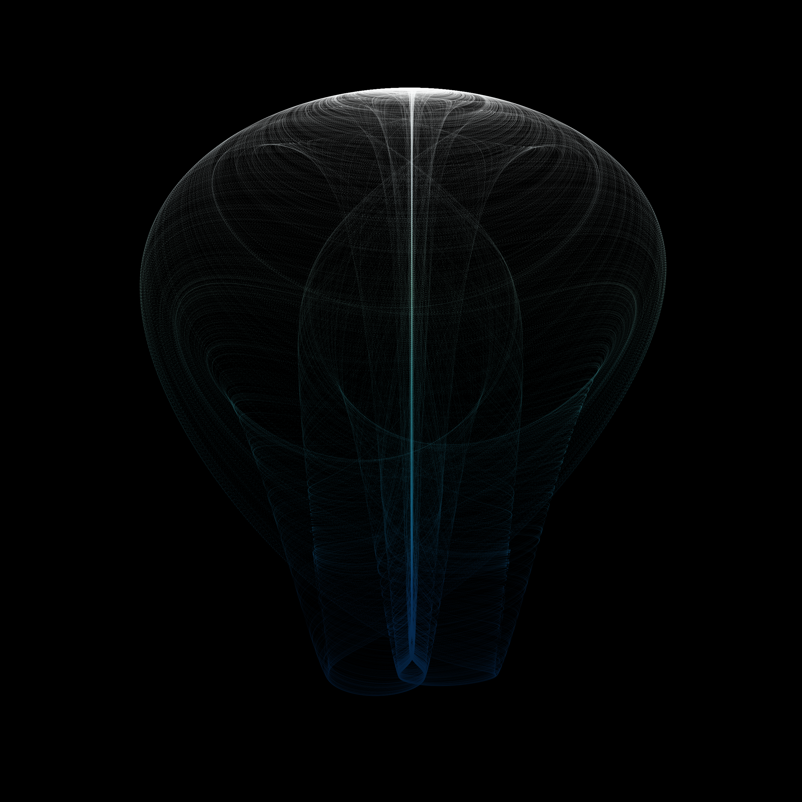 |

```
dx/dt = (a(z − b) + g)x − w·y
dy/dt = w·x + (a(z − b) − g)y          a=1.2, b=0.68, w=3.7, g=1.7,
dz/dt = mu + nu·z − z³ − lam(x² + y²)   mu=1.2, nu=2.0, lam=2.1
```

Certified the same way as Aurelia (`python scripts/verify_naiad.py`,
recorded in [`results/naiad_verification.json`](results/naiad_verification.json)):

| Property | Value |
|---|---|
| Lyapunov spectrum | **λ₁ = +0.296**, λ₂ = +0.001 ≈ 0, λ₃ = −2.696 |
| Kaplan–Yorke dimension | **D_KY ≈ 2.110** |
| λ₁ across 5 random initial conditions | 0.284 … 0.341 (always positive) |
| Convergence study (3 dt × 3 lengths × 10 ICs) | λ₁ = +0.294 ± 0.009, D_KY = 2.110 ± 0.004 |
| Equilibria | exactly one: saddle-focus at (0, 0, 1.651) |
| Eigenvalues at the equilibrium | 1.166 ± 3.286i (unstable spiral), −6.18 |
| Time-averaged divergence | −2.386 (dissipative) |
| Novelty vs the dysts catalog | nearest known system at distance **0.29–0.34** across re-simulations (the rank-1 identity flips between SprottJerk and ForcedFitzHughNagumo at this isolation) |

That novelty distance of ≈0.3 makes Naiad the *most* isolated member of the
family in shape space (Aurelia sits at 0.18), against a catalog whose median
nearest-neighbor spacing is 0.115. Like Aurelia, it is organized by a single
Shilnikov-type saddle-focus, here with a faster spiral.

## Cassiopea: the four-fold member

**Cassiopea** completes a three-member family (C₂ Naiad, C₃ Aurelia, C₄
Cassiopea), named for *Cassiopea*, the upside-down jellyfish whose bell
carries a four-leaf-clover marking: a real animal with genuine four-fold
symmetry. The equivariant term is `conj(w)³`, the unique cubic surviving a
quarter-turn `w → iw`. Seen from above the attractor is a **four-armed
pinwheel star** with a white spiral core; from the side, a layered bell
with twin curtains.

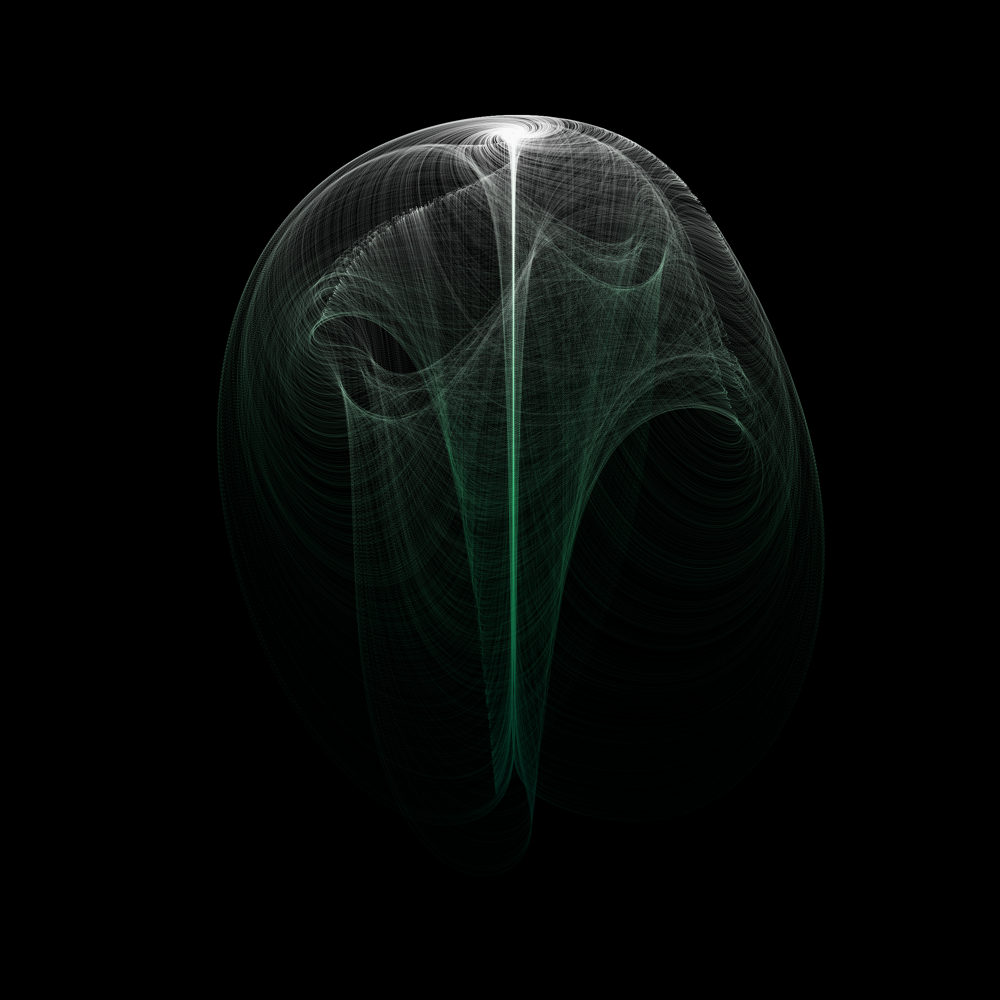

| The star (top) | The bell (side) |
|---|---|
| 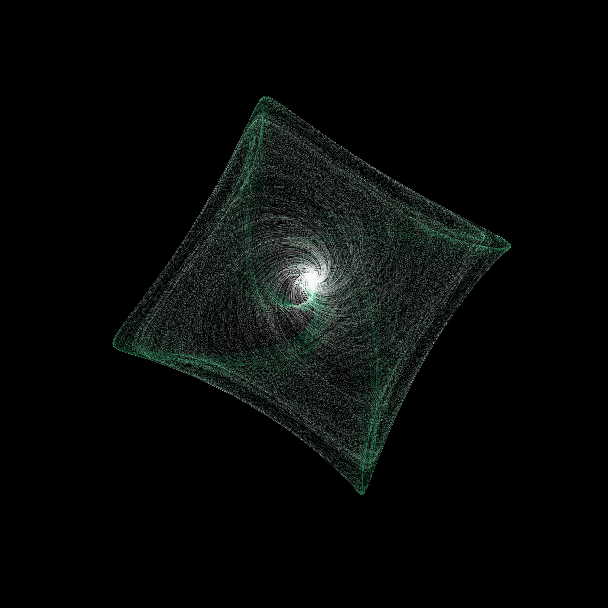 | 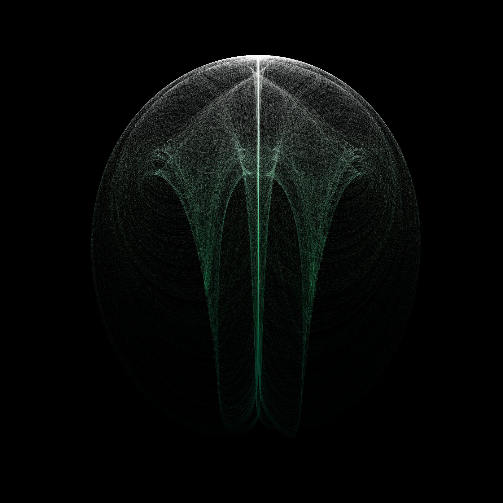 |

```
dx/dt = a(z − b)x − w·y + g(x³ − 3xy²)
dy/dt = w·x + a(z − b)y + g(y³ − 3x²y)     a=2.0, b=0.85, w=1.8, g=0.9,
dz/dt = mu + nu·z − z³ − lam(x² + y²)       mu=1.28, nu=1.8, lam=2.8
```

Certified via `python scripts/verify_cassiopea.py`
([`results/cassiopea_verification.json`](results/cassiopea_verification.json)):

| Property | Value |
|---|---|
| Lyapunov spectrum | **λ₁ = +0.525**, λ₂ ≈ 0, λ₃ = −2.412 |
| Kaplan–Yorke dimension | **D_KY ≈ 2.218** |
| λ₁ across 5 random initial conditions | 0.490 … 0.555 (always positive) |
| Convergence study (3 dt × 3 lengths × 10 ICs) | λ₁ = +0.523 ± 0.008, D_KY = 2.219 ± 0.006 |
| Equilibria | a central saddle-focus at (0, 0, 1.611) plus a C₄ quadruple of distant saddles |
| Eigenvalues at the saddle-focus | 1.522 ± 1.8i (unstable spiral), −5.984 |
| Time-averaged divergence | −1.868 (dissipative) |
| Novelty vs the dysts catalog | nearest known system NoseHoover at distance **0.17–0.22** across re-simulations (Aizawa statistically tied) |

Cassiopea carries the **strongest chaos and deepest fractal structure of the
family** (Aurelia λ₁ = 0.233, Naiad 0.296, Cassiopea 0.525), and it is the
first member with off-axis equilibria: four distant saddles at radius 3,
arranged in a square far below the attractor, with the familiar single
saddle-focus engine on the axis.

## Mobula: the rotoreflection member

The three jellyfish above are all symmetric under a pure **rotation**. **Mobula**
breaks that series: it is the first member symmetric under an *improper*
operation — a quarter-turn **combined with a vertical flip**,
`σ: (w, z) → (i·w, −z)`, and under neither the quarter-turn nor the flip alone.
This is the order-4 rotoreflection group **S₄** (Schoenflies), the point-group
symmetry of a devil ray (genus *Mobula*) breaching and somersaulting clear of
the water. From the side the attractor is a **broad-winged ray of layered
veils**; from above, a **four-fold pinwheel**. Two terms make the symmetry S₄
rather than C₄: `δ·z·conj(w)` and `ε·Im(w²)` — each allowed under the
rotoreflection but forbidden under the pure quarter-turn.

A targeted [literature strike](docs/RELATED_WORK.md) found no prior *constructed,
certified chaotic flow* whose attractor carries a rotoreflection symmetry that
is neither an inversion nor a reflection: the map literature (Reiter et al.) and
the order-2 inversion covers (Letellier–Gilmore) are the nearest prior art.

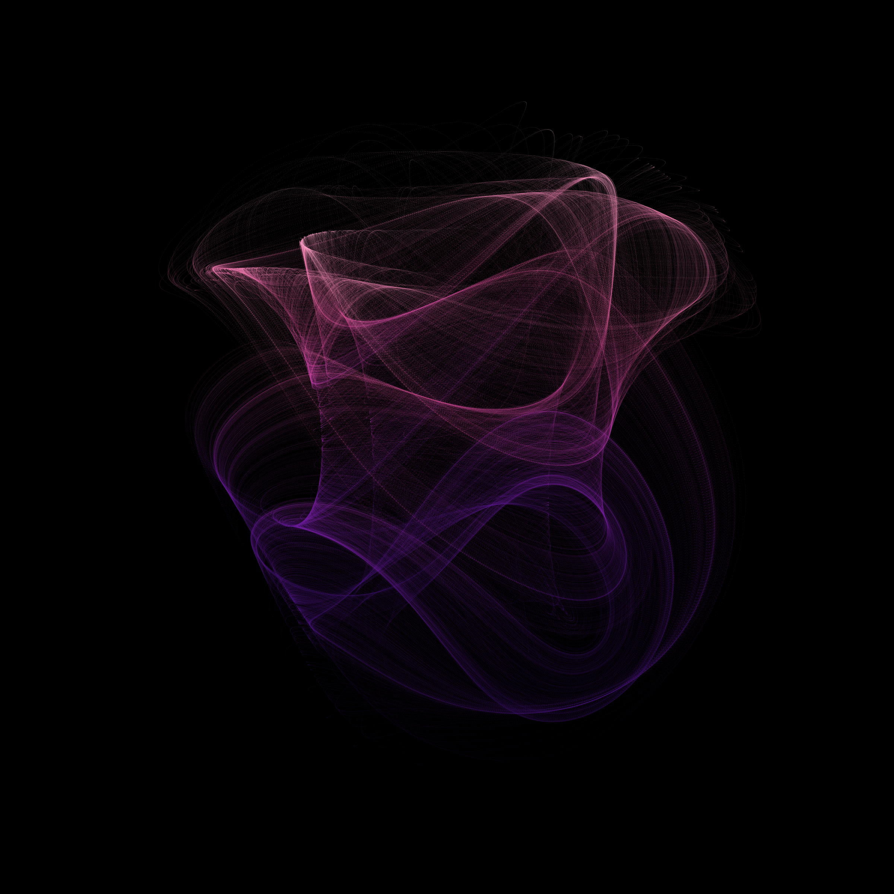

| The pinwheel (top) | The wing (side) |
|---|---|
| 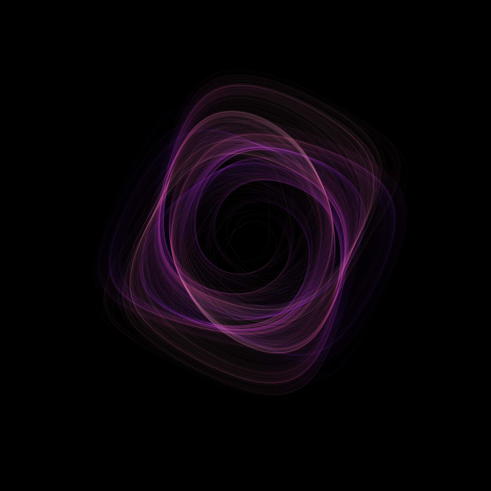 | 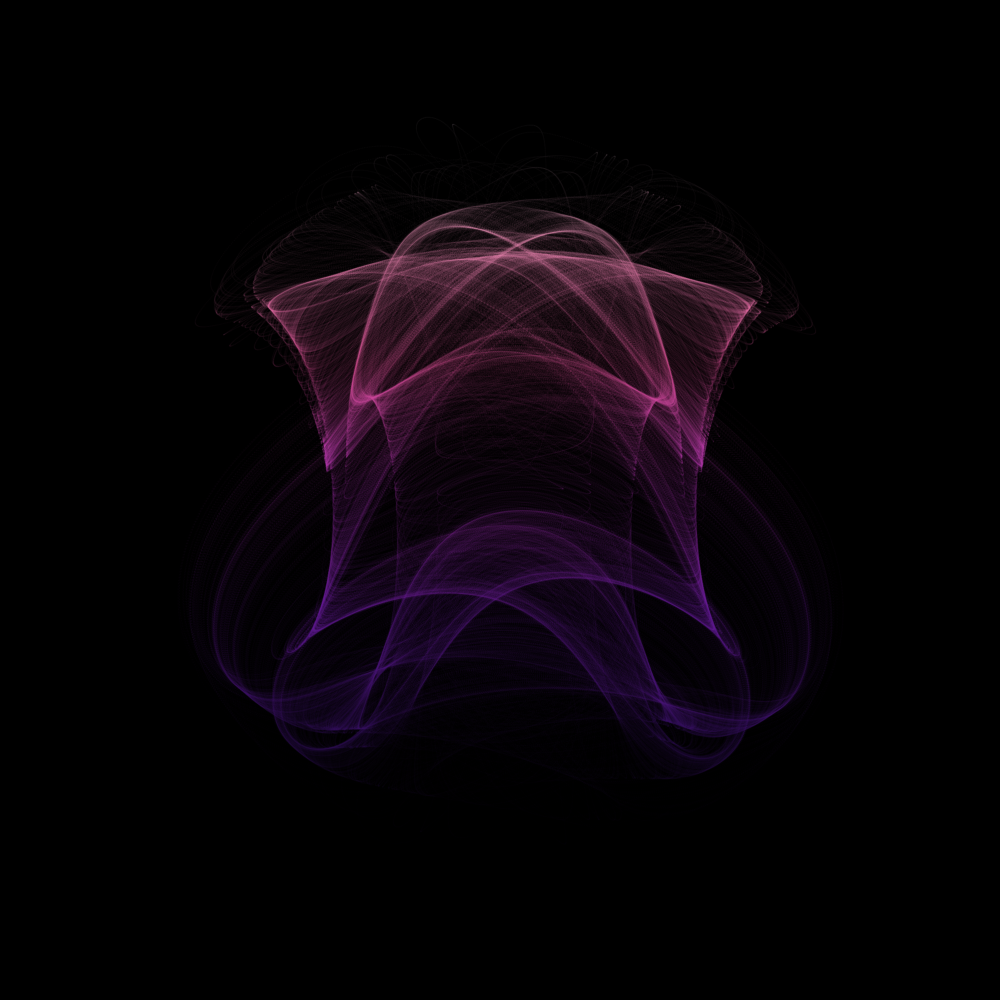 |

```
dx/dt = (α·z² − β + δ·z)x − ω·y + γ(x³ − 3xy²)    α=1.4104, β=0.6701,
dy/dt = (α·z² − β − δ·z)y + ω·x + γ(y³ − 3x²y)     ω=2.4266, γ=0.3, δ=0.5534,
dz/dt = ν·z − z³ − λ·z(x² + y²) + 2ε·xy            ν=3.3, λ=2.1355, ε=1.2153
```

Equivariance is **unit-tested numerically** (`tests/`): the real-coordinate flow
above is checked to equal the complex S₄ family to 10⁻¹², and to *break* C₄ and
the pure flip. Certified via `python scripts/verify_mobula.py`
([`results/mobula_verification.json`](results/mobula_verification.json)):

| Property | Value |
|---|---|
| Lyapunov spectrum | **λ₁ = +0.330**, λ₂ ≈ 0, λ₃ = −1.238 |
| Kaplan–Yorke dimension | **D_KY ≈ 2.266** |
| λ₁ across 5 random initial conditions | 0.334 … 0.384 (always positive) |
| Equilibria | on-axis σ-conjugate pair (0, 0, ±1.817) with *identical* eigenvalues, plus four off-axis saddles forming one order-4 σ-orbit |
| Eigenvalues at (0,0,±1.817) | 3.984 ± 2.21i (unstable spiral), −6.6 |
| S₄ symmetry residual | 0.0136, versus 0.0455 for a pure-flip control (3.3× better) — genuine rotoreflection, not flip symmetry |
| Novelty vs the dysts catalog | nearest known system NuclearQuadrupole at distance 0.273 |

The family's chaos strength is **not monotonic in symmetry order**
(λ₁: C₂ 0.296, C₃ 0.233, C₄ 0.525, S₄ 0.330) — the systematic question the
[symmetry program](docs/SYMMETRY_PROGRAM.md) sets out to map. Because S₄ forbids
a constant in `dz/dt`, Mobula's on-axis equilibria are the *symmetric* triple
`z(ν − z²) = 0`, and the symmetry is visible in the fixed-point structure: σ
exchanges the two off-axis-z equilibria and they carry identical eigenvalues.

## Reproduce everything

```bash
pip install -r requirements.txt

python scripts/verify_chaos.py        # certify Aurelia, write results/verification.json
python scripts/render_gallery.py      # render the Aurelia gallery
python scripts/bifurcation_scan.py    # sweep c, plot the route to chaos
python scripts/search_parameters.py   # re-run the original discovery search
python scripts/verify_naiad.py        # certify Naiad, write results/naiad_verification.json
python scripts/render_naiad.py        # render the Naiad gallery
python scripts/verify_cassiopea.py    # certify Cassiopea
python scripts/render_cassiopea.py    # render the Cassiopea gallery
python scripts/verify_mobula.py       # certify Mobula (S4 rotoreflection)
python scripts/render_mobula.py       # render the Mobula gallery
python scripts/convergence_study.py   # error-barred Lyapunov spectra
python scripts/validate_fingerprint.py # validate the novelty metric, draw the shape map
python scripts/homoclinic_hunt.py     # hunt Shilnikov homoclinic connections
python -m pytest tests/               # numerical equivariance + cross-check tests
```

Or use it as a library:

```python
from aurelia import trajectory

pts = trajectory(n_steps=1_000_000)   # (N, 3) points on the attractor
```

## License

MIT — see [LICENSE](LICENSE).
